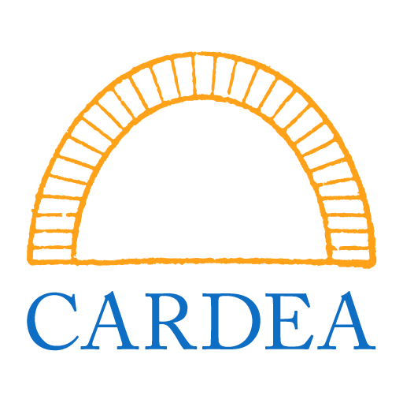
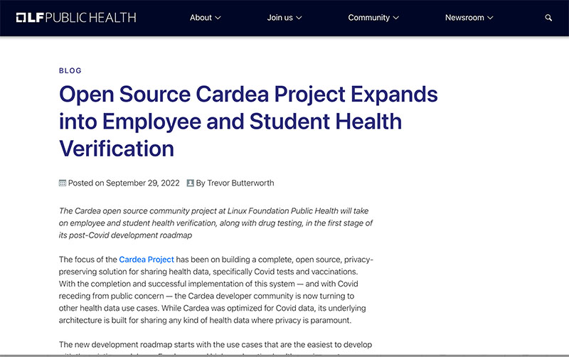
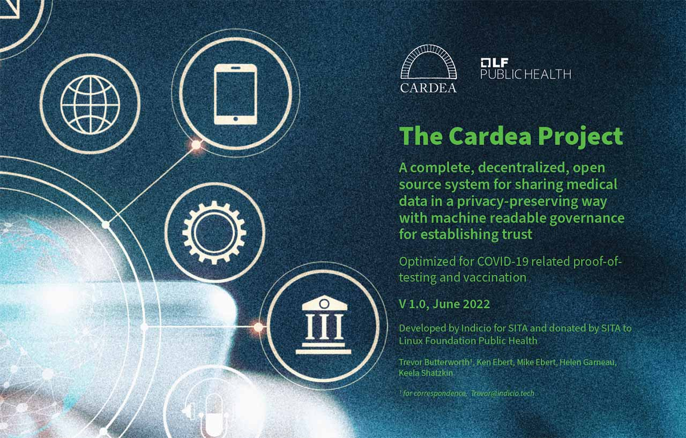
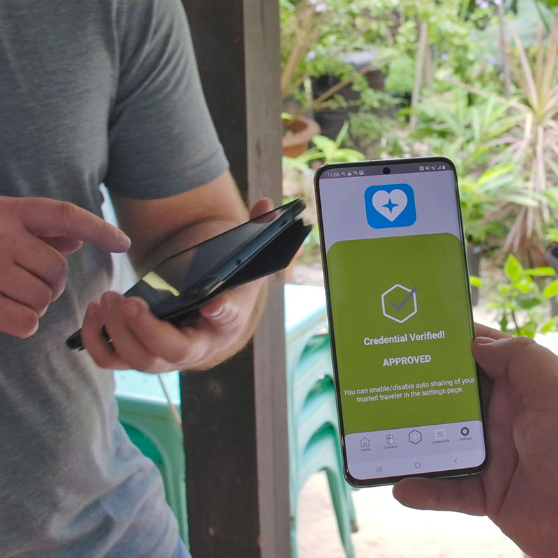
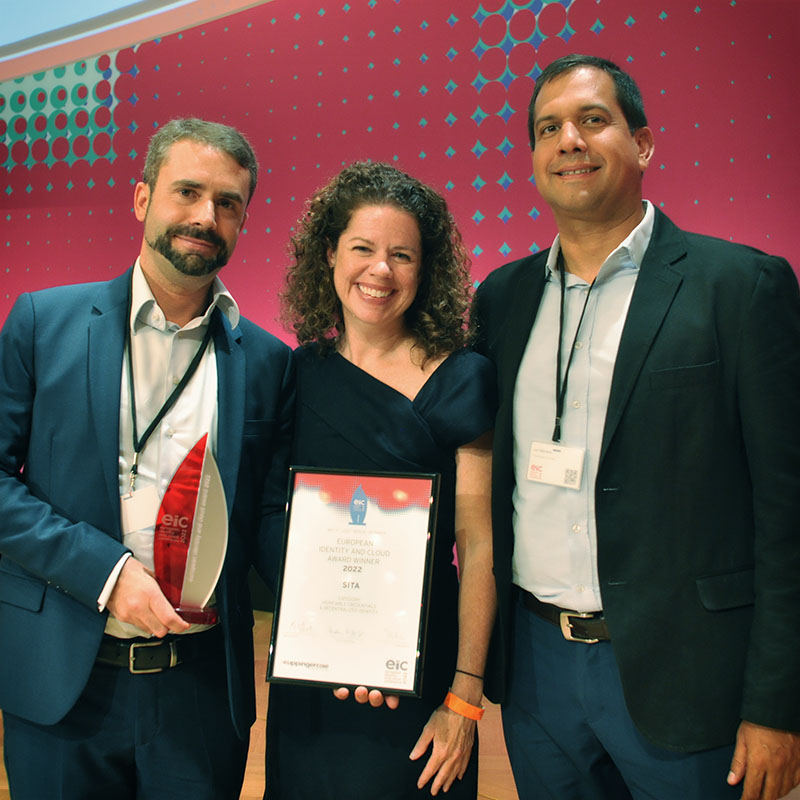

## Verify health data while preserving privacy

The world's only complete, decentralized, easy-to-integrate, open-source ecosystem for verifying health data that preserves patient and traveler privacy

## Cardea Community Group members include

Indicio, SITA, Liquid Avatar, Bronx Rhio, IdRamp, GlobalID, Lorica Identity, Shatzkin Systems

## New directions for Cardea

## The Cardea Project white paper

## Data you can't trust is a costly risk

Current solutions are expensive, insecure, and don't protect patient privacy. They create friction for travelers and fail to prevent fraud. With a global pandemic, the need to prove health status has become critical to travel and hospitality. Decentralized identity and verifiable credentials provide a way to verify the accuracy of any data in a way that preserves traveler privacy.

## How we created Cardea

Indicio, a global leader in decentralized identity technology, and SITA, the world's leading technology provider to the air transport industry, worked with the Aruba Health Department to create the Aruba Health App. It made it easy for visitors to share a trusted traveler credential  -  based on their health status  -  privately and securely on their mobile device. The underlying technology was open-sourced and donated to Hyperledger Labs, so that anyone can use it to share health data in a privacy-preserving way.

L-R: Adrien Sanglier of SITA, Heather Dahl, CEO of Indicio, and Yuri Feliciano of the Aruban Government at the 2022 European Identity and Cloud Conference

## Award winning technology

SITA, the leading provider of IT services to the air transport industry, was announced the winner of the Verifiable Credentials and Decentralized Identity award at KuppingerCole Analysts' 2022 European Identity & Cloud conference on May 13, 2022.

The award was given for SITA's work with Indicio and the Aruban government to create a seamless, decentralized, and privacy-preserving system for managing Covid tests and other health and travel data for airline passengers traveling to Aruba. The system directly connects with health providers in the U.S. and Canada to permit fraud-proof travel approval to happen before passengers arrive at the airport.

## How to partipate

### Grab the code and go make magic

Cardea is a complete, decentralized ecosystem for the exchange and verification of privacy-preserving digital credentials.

Cardea is built on the Hyperledger technology stack and is ready to deploy.

The codebase is on Github and can be accessed below:

### Office hours - ask us how to get started

Cardea is developed and maintained by the Cardea Community Group - and we're here to help guide you through how Cardea works and how you can implement it.

Sign up below for access to our office hours meetings.

(Sign up available shortly due to transition to Hyperledger Labs)

### Help advance the Cardea Community

The community group is open to anyone interested in learning about and developing Cardea.

Led by Indicio and Shatzkin Systems, active members include leading companies in the decentralized identity space.

[Sign up here for our meetings](https://lists.hyperledger.org/g/labs/topics) (2nd and 4th Thursdays of the month, 9am PST).

Cardea is a lab of the Hyperledger Foundation.

For more information, visit [Hyperledger Labs](https://github.com/hyperledger-labs)
